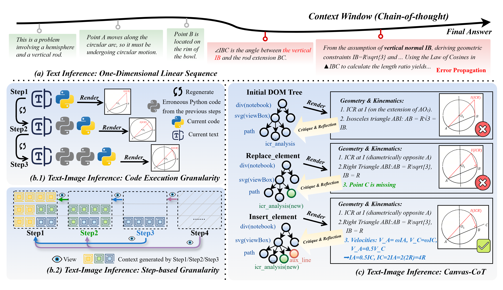
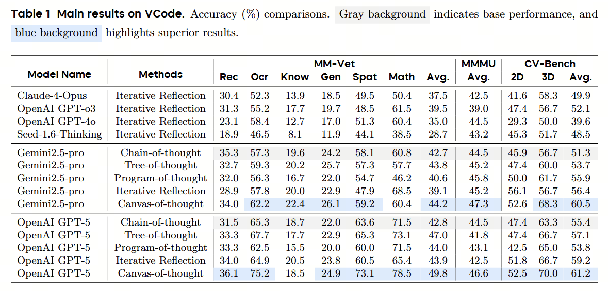
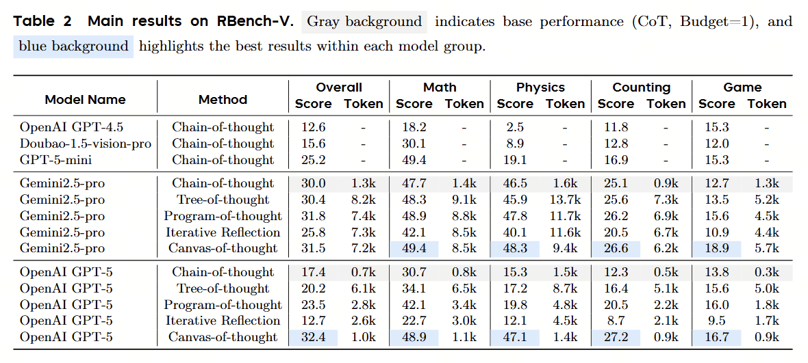
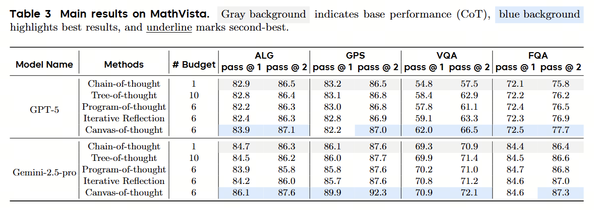

<div align="center">
  <picture>
      
  </picture>
</div>

<div align="center" style="line-height: 1;">

[]()
[](https://github.com/Zzzyxii/Canvas-CoT)

</div>

# Introduction

This repository contains the core implementation of a **Visual-Reasoning Agent** designed to solve complex physics and mathematical problems through a synchronized **Visual Chain-of-Thought (Canvas-CoT)**. The system enables a Large Language Model (LLM) to act as an agent that "thinks" on a virtual notebook, bridging the gap between symbolic reasoning and visual representation.

<div align="center">
  <picture>
      
  </picture>
</div>

## 📂 Module Architecture

| File | Description |
| :--- | :--- |
| `openai_model_v9.py` | **Core Controller**: Manages the multi-round agent loop, including `<think>` processing, tool calling, and the integration of the `CRITIQUE_SYSTEM`. |
| `blackboard.py` | **Rendering Engine**: Uses `Playwright` and `BeautifulSoup` to maintain the HTML/SVG state and render high-definition screenshots of the agent's "notebook". |
| `blackboard_tools.py` | **Tool Definitions**: Defines the atomic API for the agent: `insert_element`, `modify_element`, `replace_element`, and `remove_element`. |
| `model_utils.py` | **Utilities**: Support functions for image processing (Base64 encoding, resizing) and robust API call handling with retry logic. |

## 🛠️ Key Features

* **Synchronized Visual Notebook**: The agent synchronizes its internal thought process with an external visual memory via incremental SVG updates.
* **Physics-First Reasoning**: Specialized prompts force the agent to identify motion constraints and physical laws before performing algebraic calculations.
* **Automated Critique Loop**: After every visual update, a secondary expert prompt compares the "Blackboard State" against the original image to detect visual, physical, or mathematical errors.
* **Offline-Safe Rendering**: Includes built-in sanitization to prevent external URL dependencies, ensuring deterministic rendering in sandboxed environments.

## ⚙️ Requirements

* **Python**: 3.8+
* **Core Dependencies**: `openai`, `playwright`, `beautifulsoup4`, `lxml`, `Pillow`
* **Browser Engine**: Playwright Chromium

```bash
pip install openai playwright beautifulsoup4 lxml Pillow
playwright install chromium 
```


## 📊 Experimental Results

We evaluated the **Canvas-of-thought** method against several baseline reasoning strategies (Chain-of-thought, Tree-of-thought, etc.) across multiple benchmarks. Some of the results are presented here:

<div align="center">
  <p><b>1. Performance on VCode</b></p>
  
</div>

<br>

<div align="center">
  <p><b>2. Performance on RBench-V</b></p>
  
</div>

<br>

<div align="center">
  <p><b>3. Performance on MathVista</b></p>
  
</div>

## Citation