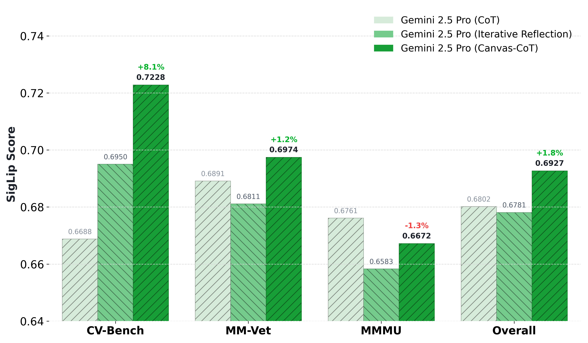
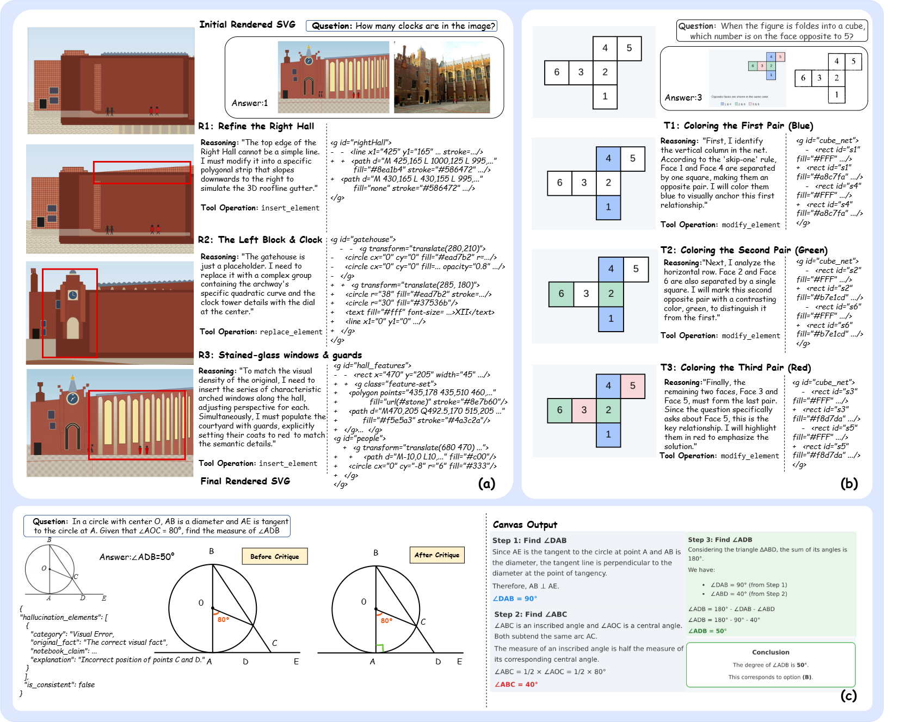
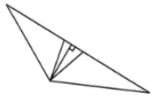

<div align="center">
  <picture>
      
  </picture>
</div>

<div align="center" style="line-height: 1;">

</div>

# Introduction

This repository contains the core implementation of a **Visual-Reasoning Agent** designed to solve complex physics and mathematical problems through a synchronized **Visual Chain-of-Thought (Canvas-CoT)**. The system enables a Large Language Model (LLM) to act as an agent that "thinks" on a virtual notebook, bridging the gap between symbolic reasoning and visual representation.

<div align="center">
  <picture>
      
  </picture>
</div>

## 📂 Module Architecture

| File | Description |
| :--- | :--- |
| `openai_model_v9.py` | **Core Controller**: Manages the multi-round agent loop, including `<think>` processing, tool calling, and the integration of the `CRITIQUE_SYSTEM`. |
| `blackboard.py` | **Rendering Engine**: Uses `Playwright` and `BeautifulSoup` to maintain the HTML/SVG state and render high-definition screenshots of the agent's "notebook". |
| `blackboard_tools.py` | **Tool Definitions**: Defines the atomic API for the agent: `insert_element`, `modify_element`, `replace_element`, and `remove_element`. |
| `model_utils.py` | **Utilities**: Support functions for image processing (Base64 encoding, resizing) and robust API call handling with retry logic. |

## 🛠️ Key Features

* **Synchronized Visual Notebook**: The agent synchronizes its internal thought process with an external visual memory via incremental SVG updates.
* **Physics-First Reasoning**: Specialized prompts force the agent to identify motion constraints and physical laws before performing algebraic calculations.
* **Automated Critique Loop**: After every visual update, a secondary expert prompt compares the "Blackboard State" against the original image to detect visual, physical, or mathematical errors.
* **Offline-Safe Rendering**: Includes built-in sanitization to prevent external URL dependencies, ensuring deterministic rendering in sandboxed environments.

## ⚙️ Requirements

* **Python**: 3.8+
* **Core Dependencies**: `openai`, `playwright`, `beautifulsoup4`, `lxml`, `Pillow`
* **Browser Engine**: Playwright Chromium

```bash
pip install openai playwright beautifulsoup4 lxml Pillow
playwright install chromium 
```


## 📊 Experimental Results

We evaluated the **Canvas-of-thought** method against several baseline reasoning strategies (Chain-of-thought, Tree-of-thought, etc.) across multiple benchmarks. Some of the results are presented here:

<div align="center">
  <p><b>1. Performance on VCode</b></p>
  
</div>

<br>

<div align="center">
  <p><b>2. Performance on RBench-V</b></p>
  
</div>

<br>

<div align="center">
  <p><b>3. Performance on MathVista</b></p>
  
</div>

---

## Appendix

### Table of Contents

- [A. Implementation Details](#a-implementation-details)
  - [A.1. Model Configurations](#a1-model-configurations)
  - [A.2. Reasoning Substrate and Rendering](#a2-reasoning-substrate-and-rendering)
- [B. SigLip Score on VCode Benchmark](#b-siglip-score-on-vcode-benchmark)
- [C. Detailed Related Work](#c-detailed-related-work)
- [D. Detailed Benchmark Introduction](#d-detailed-benchmark-introduction)
  - [D.1. VCode](#d1-vcode)
  - [D.2. RBench-V](#d2-rbench-v)
  - [D.3. MathVista](#d3-mathvista)
- [E. Qualitative Case Studies](#e-qualitative-case-studies)
- [F. Detailed Case Analysis](#f-detailed-case-analysis)
  - [F.1. VCode Cases](#f1-vcode-cases)
    - [F.1.1. Final Image Rendered by SVG](#f11-final-image-rendered-by-svg)
    - [F.1.2. CRUD-Action Trajectory of Canvas-CoT](#f12-crud-action-trajectory-of-canvas-cot)
  - [F.2. RBench-V Cases](#f2-rbench-v-cases)
- [G. Prompts](#g-prompts)
  - [G.1. VCode Prompts](#g1-vcode-prompts)
  - [G.2. RBench-V & MathVista Prompts](#g2-rbench-v--mathvista-prompts)

---

## A. Implementation Details

### A.1. Model Configurations

We evaluate Canvas-CoT using two primary Multimodal Large Language Model (MLLM) backbones: GPT-5 and Gemini 2.5 Pro. To ensure reproducibility and minimize variance in the reasoning trajectory, we set the sampling temperature to 0 for all distinct inference runs. The framework is model-agnostic, interacting with the backend purely through standard chat completion APIs.

### A.2. Reasoning Substrate and Rendering

The Reasoning Substrate *S* is implemented as a lightweight HTML5 environment managed by a headless browser engine.

- **Initialization**: At timestep t=0, the substrate is initialized with a minimal HTML boilerplate containing an empty `<body>` tag.
- **Parsing Layer**: We implement a deterministic parsing function that validates raw HTML/SVG fragments generated by the model. This layer filters malformed tags and ensures that all operations (Insert, Replace, Modify) result in a valid, renderable DOM tree before state transition.
- **Rendering**: For the visual critique loop, the headless browser renders the current DOM state into a high-resolution raster image (V_state), which is then downsampled to match the resolution of the original input image (V_orig) for pixel-aligned comparison.

---

## B. SigLip Score on VCode Benchmark

To further validate the quality of the generated SVG code beyond structural correctness, we evaluate the semantic alignment between the rendered outputs and the ground truth visual concepts using the SigLip metric. The figure below presents a comparative analysis of Gemini 2.5 Pro across three settings: standard Chain-of-Thought (CoT), Iterative Reflection, and our proposed Canvas-CoT.

The most significant performance gain is observed on the CV-Bench subset, where Canvas-CoT achieves a SigLip score of **72.28**, representing a substantial **+8.1%** improvement over the CoT baseline (66.88) and outperforming Iterative Reflection (69.50).

On the MM-Vet subset, we observe a notable pathology in the text-only Iterative Reflection baseline, where performance actually **degrades** compared to standard CoT (68.91 → 68.11). This phenomenon aligns with the "hallucination snowballing" effect discussed in Section 1, where purely verbal self-correction introduces noise. In contrast, Canvas-CoT reverses this trend, achieving a score of **69.74** (+1.2%). This demonstrates that the Rendering-Critique loop acts as a hard constraint validator, preventing the semantic drift common in ungrounded reasoning chains.



---

## C. Detailed Related Work

The evolution of MLLM reasoning can be characterized by two orthogonal dimensions: the analyzability of the reasoning process (explicit vs. latent) and the topology of the reasoning substrate (append-only vs. structurally addressable).

**Linear Explicit Substrates.** Foundational paradigms, established by Chain-of-Thought and extended by search-based methods like Tree-of-Thoughts and Graph-of-Thoughts, rely on explicit natural language tokens. A separate lineage introduces structure through executable code (PoT), tool-calling (ReAct), or iterative symbolic refinement (VCode). While these methods move toward a "System 2" cognitive mode by enabling deliberate planning, they remain restricted by an append-only and immutable substrate. Because the reasoning trace is treated as a monolithic linear log rather than a structurally addressable state, correcting a local error requires regenerating the entire downstream context. This imposes a prohibitive serialization tax as trajectories scale in the test-time compute era.

**Linear Latent Substrates.** To improve inference density and bypass the verbosity of natural language, latent-space frameworks like Coconut, CODI, and CoLaR compress reasoning paths into continuous vectors. However, this density sacrifices analyzability, transforming internal world model states into an opaque latent space where states cannot be explicitly traced or intervened upon.

Canvas-CoT replaces linear, append-only reasoning with a structural, white-box DOM substrate. By decoupling reasoning logic from state persistence and employing ID-addressable nodes, the framework enables atomic CRUD operations. This shift significantly reduces the token generation overhead required for error correction, allowing precise, in-place updates without downstream context disruption. Finally, a Rendering-Critique loop provides grounded feedback, enabling the model to perform autonomous self-correction.

---

## D. Detailed Benchmark Introduction

### D.1. VCode

The VCode benchmark consists of 464 image-question pairs across three domains: general common sense (MM-Vet), professional disciplines (MMMU), and vision-centric perception (CV-Bench). It constructs tasks of varying dimensions and difficulty levels to evaluate a model's capability in transforming images into SVG code. VCode employs two primary evaluation metrics: the SigLIP score and CodeVQA. These metrics assess the semantic consistency between the rendered SVG and the original image, and the accuracy of the model's answers based on the rendered SVG, respectively.

### D.2. RBench-V

The RBench-V benchmark focuses on assessing the reasoning robustness of multimodal models in visual tasks. The dataset contains 803 questions covering core dimensions such as spatial relations, attribute comparison, and logical reasoning. Its evaluation metrics go beyond final answer accuracy by introducing a reasoning consistency indicator. By testing different linguistic expressions of the same visual logic, it evaluates whether the model's reasoning remains stable under perturbations or varying prompts, thereby effectively identifying potential "hallucinations" in the model.

### D.3. MathVista

MathVista is a comprehensive benchmark designed to evaluate mathematical reasoning capabilities within visual contexts and is currently regarded as one of the most authoritative benchmarks in this field. The dataset integrates 6,141 samples from 28 existing benchmarks along with three newly constructed datasets (IQTest, FunctionQA, and PaperQA). It covers seven categories of mathematical reasoning tasks, including elementary mathematics, competition-level math, and scientific chart understanding (e.g., algebraic reasoning, geometric problems, and statistical chart analysis). The primary evaluation metric is Accuracy, with fine-grained scoring based on task difficulty and knowledge domains, providing a comprehensive measurement of a model's overall proficiency in solving complex visual mathematical problems.

---

## E. Qualitative Case Studies

To concretize the epistemic advantages of Canvas-of-Thought, we conduct a qualitative analysis of three representative reasoning modes. Each case demonstrates how our framework transcends the limitations of linear text generation by leveraging the structured, mutable, and grounded nature of the DOM substrate.



**Precision in Structural Generation via ID-Addressable Reasoning.**
In the Image-to-SVG task, our method excels at refining complex architectural geometries after an initial draft. Standard CoT and Iterative Reflection often struggle here, as correcting a local error—such as a roofline's perspective or clock face details—typically requires regenerating the entire code block, increasing the risk of cascading hallucinations and raising token consumption. Canvas-CoT leverages ID-Addressable Reasoning by assigning unique identifiers to semantic components like `<g id="rightHall">` and `<g id="gatehouse">`, effectively creating a discrete memory bank. For instance, when upgrading the `gatehouse` from a rough placeholder to a detailed structure, the Solver Agent executes a targeted `replace_element` operation solely on the `gatehouse` node. Similarly, it applies precise `insert_element` operations to the `rightHall` to correct the 3D roofline strip. This bypasses the "append-only" limitation, enabling direct indexing and editing of specific reasoning states without disturbing the global context.

**Efficiency in Spatial Logic via Atomic State Mutability.**
For a Cube Net Folding problem requiring the identification of opposite faces, solving via text-only CoT demands maintaining a high mental load to track spatial permutations, often leading to "lost-in-the-middle" errors. Canvas-CoT addresses this through Atomic State Mutability. As the agent identifies face pairs, it executes `modify_element` calls to update their visual attributes (e.g., `fill="blue"`). These O(1) atomic updates offload the cognitive burden onto the canvas. The visual state thus serves as a dynamic external working memory, where logical validity is maintained through persistent state mutations rather than transient tokens.

**Error Correction via Visual-Physical Grounding.**
For a geometry problem requiring the calculation of ∠ADB, a common failure mode in text-based reasoning is visual alignment error, where the model retrieves correct geometric properties but fails to map them accurately to visual entities. Initially, the agent incorrectly plotted the positions of points C and D, generating a visual state where their coordinate labels are swapped. Canvas-CoT addresses this by introducing a rendering-critique loop. The critique module compares the rendered diagram against the original visual evidence, immediately flagging the misalignment of labels C and D. This feedback triggers a corrective `modify_element` operation to swap the coordinates, ensuring geometric consistency.

---

## F. Detailed Case Analysis

### F.1. VCode Cases

This section presents a qualitative comparison on the VCode benchmark to demonstrate the efficacy of Canvas-CoT in structured image generation. MM-VET, MMMU, and CV-Bench are subsets of this benchmark. In [F.1.1](#f11-final-image-rendered-by-svg), we compare Canvas-CoT against the same base models employing 5-round Iterative Reflection. In [F.1.2](#f12-crud-action-trajectory-of-canvas-cot), we illustrate the CRUD action trajectory of Canvas-CoT to achieve precise refinement of SVG structures.

In the following figures, **"IR"** denotes Iterative Reflection.

#### F.1.1. Final Image Rendered by SVG

*(Legend: ✅ = correct, 🟡 = partial, ❌ = incorrect)*

**MMVET — Case v1_36**

**Q:** What should we add in the third step? **A:** milk

Key Points: 1. Third step item count: milk, whisk, bowl. 2. Realism of object shape representation. 3. Overall layout fidelity.

| Original Image | Gemini-2.5-pro (ours) | GPT-5 (ours) | Gemini-2.5-pro (IR) | GPT-5 (IR) |
|:---:|:---:|:---:|:---:|:---:|
|  |  |  |  |  |
| ✅ ✅ ✅ | ✅ ✅ ✅ | ✅ ✅ ✅ | ✅ 🟡 🟡 | ❌ 🟡 🟡 |

**MMVET — Case v1_184**

**Q:** Can you give a short introduction to this painting? **A:** The Arnolfini Portrait (or other titles) is a 1434 oil painting on oak panel by the Early Netherlandish painter Jan van Eyck. ... The painting was bought by the National Gallery in London in 1842.

Key Points: 1. Aspect ratio of the image. 2. Fidelity of object shape restoration. 3. Color fidelity. 4. Image detail fidelity.

| Original Image | Gemini-2.5-pro (ours) | GPT-5 (ours) | Gemini-2.5-pro (IR) | GPT-5 (IR) |
|:---:|:---:|:---:|:---:|:---:|
|  |  |  |  |  |
| ✅ ✅ ✅ ✅ | ✅ ✅ ✅ 🟡 | ✅ 🟡 ✅ 🟡 | ❌ 🟡 ✅ ❌ | ❌ 🟡 ✅ ❌ |

**MMVET — Case v1_23**

**Q:** What is the price for tomatoes? **A:** eight \<OR\> 8.0

Key Points: 1. Whether the tomato is present. 2. Relative positions between the tomato and its price tag. 3. Scene restoration fidelity. 4. Fruit detail restoration accuracy.

| Original Image | Gemini-2.5-pro (ours) | GPT-5 (ours) | Gemini-2.5-pro (IR) | GPT-5 (IR) |
|:---:|:---:|:---:|:---:|:---:|
|  |  |  |  |  |
| ✅ ✅ ✅ ✅ | ✅ ✅ 🟡 🟡 | ✅ ❌ ✅ 🟡 | ✅ ✅ 🟡 🟡 | ❌ ❌ 🟡 🟡 |

---

**MMMU — Case dev_Physics_5_img1**

**Q:** A battery, an ammeter, three resistors, and a switch are connected to form the simple circuit shown above. When the switch is closed what would happen to the potential difference across the 15 ohm resistor? (A) it would equal the potential difference across the 20 ohm resistor (B) it would be twice the potential difference across the 30 ohm resistor (C) it would equal the potential difference across the 30 ohm resistor (D) it would be half the potential difference across the 30 ohm resistor **A:** (C)

Key Points: 1. Switch S open/closed status. 2. Correct representation of fundamental circuit components. 3. Clear annotation.

| Original Image | Gemini-2.5-pro (ours) | GPT-5 (ours) | Gemini-2.5-pro (IR) | GPT-5 (IR) |
|:---:|:---:|:---:|:---:|:---:|
|  |  |  |  |  |
| ✅ ✅ ✅ | ✅ ✅ ✅ | ✅ 🟡 ✅ | ✅ 🟡 ✅ | ❌ 🟡 ❌ |

**MMMU — Case dev_Accounting_4_img1**

**Q:** Paper Submarine Manufacturing is investigating a lockbox system to reduce its collection time. It has determined the following: The total collection time will be reduced by three days if the lockbox system is adopted. What is the net cash flow per check from adopting? (A) \$.02 (B) \$7.79 (C) \$8.65 **A:** (A)

Key Points: 1. Text is clear without overlapping. 2. Content is completely identical. 3. Proportional layout is reasonable.

| Original Image | Gemini-2.5-pro (ours) | GPT-5 (ours) | Gemini-2.5-pro (IR) | GPT-5 (IR) |
|:---:|:---:|:---:|:---:|:---:|
|  |  |  |  |  |
| ✅ ✅ ✅ | ✅ ✅ ✅ | ✅ ✅ ✅ | ❌ 🟡 🟡 | ✅ ✅ 🟡 |

---

**CV-Bench — Case coco_63**

**Q:** How many clocks are in the image? (A) 2 (B) 1 (C) 0 (D) 3 **A:** B

Key Points: 1. There is a clock on the clock tower. 2. Two guards and two tourists in the square. 3. Right perspective relationship of the building. 4. Windows on the right wall.

| Original Image | Gemini-2.5-pro (ours) | GPT-5 (ours) | Gemini-2.5-pro (IR) | GPT-5 (IR) |
|:---:|:---:|:---:|:---:|:---:|
|  |  |  |  |  |
| ✅ ✅ ✅ ✅ | ✅ ✅ 🟡 ✅ | ✅ ✅ 🟡 ✅ | ✅ ✅ 🟡 🟡 | ✅ ❌ ❌ 🟡 |

**CV-Bench — Case omni3d_hypersim_140**

**Q:** Which object is closer to the desk (highlighted by a red box), the books (highlighted by a blue box) or the shelves (highlighted by a green box)? (A) books (B) shelves **A:** B

Key Points: 1. Three bounding boxes are accurately calibrated. 2. The objects represented by the bounding box annotations are accurate. 3. The spatial orientation of the stairs is correct. 4. Environmental detail representation.

| Original Image | Gemini-2.5-pro (ours) | GPT-5 (ours) | Gemini-2.5-pro (IR) | GPT-5 (IR) |
|:---:|:---:|:---:|:---:|:---:|
|  |  |  |  |  |
| ✅ ✅ ✅ ✅ | ✅ ✅ 🟡 ✅ | ✅ 🟡 🟡 ✅ | ❌ 🟡 🟡 🟡 | ✅ ✅ 🟡 🟡 |

**CV-Bench — Case ade20k_668**

**Q:** Considering the relative positions of the wall (annotated by the red box) and the door in the image provided, where is the wall (annotated by the red box) located with respect to the door? (A) left (B) right **A:** B

Key Points: 1. A bounding box is accurately calibrated. 2. Spatial relationship of the spiral staircase. 3. Scene restoration fidelity.

| Original Image | Gemini-2.5-pro (ours) | GPT-5 (ours) | Gemini-2.5-pro (IR) | GPT-5 (IR) |
|:---:|:---:|:---:|:---:|:---:|
|  |  |  |  |  |
| ✅ ✅ ✅ | ✅ ✅ ✅ | ✅ 🟡 ✅ | ✅ 🟡 🟡 | ✅ 🟡 🟡 |

**CV-Bench — Case omni3d_sunrgbd_109**

**Q:** Which object is closer to the camera taking this photo, the night stand (highlighted by a red box) or the chair (highlighted by a blue box)? (A) night stand (B) chair **A:** A

Key Points: 1. Two bounding boxes are accurately shown. 2. The objects represented by the bounding box annotations are accurate. 3. Right perspective relationship of the bed frame. 4. Environmental detail representation.

| Original Image | Gemini-2.5-pro (ours) | GPT-5 (ours) | Gemini-2.5-pro (IR) | GPT-5 (IR) |
|:---:|:---:|:---:|:---:|:---:|
|  |  |  |  |  |
| ✅ ✅ ✅ ✅ | ✅ ✅ ✅ ✅ | ✅ ✅ 🟡 🟡 | ❌ 🟡 ❌ 🟡 | ✅ ✅ 🟡 🟡 |

#### F.1.2. CRUD-Action Trajectory of Canvas-CoT

Figure below illustrates the execution flow of Canvas-CoT via a "Bar Chart Correction" task. The agent begins by identifying layout and styling discrepancies, utilizing `insert_element` to externalize its reasoning onto the canvas. Guided by this analysis, the agent then performs a `replace_element` operation to modify the target SVG node in-place, specifically recalculating bar coordinates and styling attributes. Finally, the agent employs `remove_element` to delete the auxiliary reasoning nodes from the canvas.

**Image evolution with CRUD-Action Trajectory:**

| (a) Original Image | (b) Initial SVG | (c) After Round-1 | (d) After Round-2 | (e) Final SVG |
|:---:|:---:|:---:|:---:|:---:|
|  |  |  |  |  |

**Task: Image-to-SVG and Chart Information Recognition**

> **Goal:** Correct the initial SVG using structural CRUD operations to maintain a traceable and modifiable reasoning state. And answer the question: what is the average total fueling cost excluding the Ford F150?

| Role | Trajectory Step |
|---|---|
| **Solver** | **[Round 1: Externalizing Analysis via `insert_element`]** *Input: System Prompt + User Prompt + Initial SVG Code + Original Image + Image Rendered by Initial SVG* `<think>` The user wants me to correct an SVG image to match an original image. Issues identified: (1) **Layout and Sizing**: Elements extend beyond the `viewBox` of `0 0 300 600`. (2) **Proportions**: Absolute positions, widths, and spacing do not match the compact and centered layout. (3) **Color**: Current fill is `#b030b0` (purple), but original uses `#a629a6`. (4) **Shape**: Bars in original have slightly rounded corners; current SVG rects are sharp-cornered. (5) **Text Positioning**: Costs and labels are misplaced due to underlying layout errors. `</think>` |
| | `<tool_call>{"name":"insert_element", "arguments":{"rootId":"root", "fragment":"<div id='analysis'>... (issues 1-5) ...</div>"}}</tool_call>` |
| **Critique** | *Current State: (c) above.* `<tool_response>` [Action Result] The second image is the result of `tool_call insert_element`. ...(Critique Prompt) `</tool_response>` |
| **Solver** | **[Round 2: Update via `replace_element`]** `<think>` I have already calculated the new layout parameters: ViewBox `0 0 300 600`, Bar Width `70px`, Spacing `25px`, Horizontal Margin `20px`. Bar X-coordinates: `20`, `115`, `210`, with proportional heights (`450px`, `284px`, `243px`) bottom-aligned at y=470. `</think>` |
| | `<tool_call>{"name":"replace_element", "arguments":{"targetId":"main_svg", "fragment":"<svg id=\"main_svg\" viewBox=\"0 0 300 600\"><rect id=\"bar1\" fill=\"#a629a6\" height=\"450\" width=\"70\" x=\"20\" y=\"20\" rx=\"4\" ry=\"4\"/>...<text id=\"cost1\" ...>$130.96</text>...</svg>"}}</tool_call>` |
| **Critique** | *Current State: (d) above.* `<tool_response>` [Action Result] The second image is the result of `tool_call replace_element`. ...(Critique Prompt) `</tool_response>` |
| **Solver** | **[Round 3: Remove Redundant Content via `remove_element`]** `<think>` The correction is verified. The SVG on the notebook now accurately represents the original image. I will now remove the analysis node. `</think>` |
| | `<tool_call>{"name":"remove_element", "arguments":{"targetId":"analysis"}}</tool_call>` |
| **Critique** | *Final State: (e) above.* `<tool_response>` [Action Result] The second image is the result of `tool_call remove_element`. ...(Critique Prompt) `</tool_response>` |
| **Final Ans.** | `<answer><svg id="main_svg" viewBox="0 0 300 600" ...><rect id="bar1" fill="#a629a6" height="450" width="70" x="20" y="20" rx="4" ry="4"></rect>...(Final SVG Code)</svg></answer>` |

### F.2. RBench-V Cases

#### Case 1: Geometry Calculation — Critique-Driven Correction

**Task:** In triangle △ABC, the bisector of angle ∠B and the bisector of the exterior angle at vertex C intersect at point D. Given that ∠A = 27°, what is the measure of angle ∠BDC?

| Role | Trajectory Step |
|---|---|
| **System** | *System prompt* |
| **User** | *Question* |
| **Solver** | **[Round 1]** Here is a step-by-step derivation to find the measure of angle ∠BDC. I'll visualize the geometric setup described in the problem. `<tool_call>{"name":"insert_element", "arguments":{"rootId":"root", "fragment":"<div id=\"step1\"...><strong>Problem Setup</strong>...</div>","beforeId":null}}</tool_call>` *(Note: The agent internally generates a diagram where the extension line incorrectly starts from vertex A.)* |
| **Critique** | ⚠️ **[WARNING] CRITIQUE TRIGGERED: Visual-Textual Inconsistency** — **Hallucination Detect:** `True`. **Issue:** The problem and textual solution correctly state the exterior angle is formed by extending side BC. However, the diagram in "Problem Setup" visually depicts the extension of side AC. The mathematical derivation correctly follows extending BC, but the visual aid is wrong. |
| **Solver** | **[Self-Correction]** "The diagram incorrectly shows a dashed line originating from vertex A." `replace_element(targetId="step1", ...)` |
| | **Before Critique** (incorrect extension from A) → **After Correction** (correct extension from B): |
| | <table><tr><td align="center"><br/><b>Before Critique</b> (incorrect extension from A)</td><td align="center"><br/><b>After Correction</b> (correct extension from B)</td></tr></table> |
| **Solver** | **[Final Derivation]** With the corrected setup: (1) Angle sum of △BDC = 180°. (2) Derived ∠BDC = ∠A / 2. **Calculation:** ∠BDC = 27° / 2 = **13.5°**. `<answer>13.5°</answer>` |

> The Canvas-CoT agent initially hallucinates the geometric construction (extending the wrong side). The Critique Agent identifies the mismatch between the correct textual logic and the incorrect visual rendering. The agent then executes an atomic CRUD update to fix the canvas before deriving the final answer.

#### Case 2: Visual Reasoning & Geometry Counting

**Task:** In the figure shown (), there are a total of ( ) triangles. Solve the question according to the given picture step-by-step.

| Role | Trajectory Step |
|---|---|
| **System** | *System prompt* |
| **User** | *Question + Original Input Image* |
| **Solver** | **[Round 1]** I will analyze the triangle structure and count them. `<tool_call>{"name":"insert_element", "arguments":{"fragment":"<svg id='fig1'>...<line x2='140'/><line x2='260'/>...</svg>"}}</tool_call>` *(Note: The agent generates a diagram with only **2** internal lines instead of 3, leading to an incorrect total count of 6.)* |
| **Critique** | ⚠️ **[WARNING] CRITIQUE: Fundamental Visual Error** — **Hallucination Detect:** `True`. The original image has **3 internal lines**, dividing the base into 5 points. The notebook shows only **2 lines**. This misrepresentation makes the subsequent count (6) incorrect. The correct count should be C(5,2) = 10. |
| **Solver** | **[Self-Correction]** Clearing the canvas to redraw the correct structure with 5 points on the base (B, C, D, E, F). `clear()`; `insert_element(fragment="<svg id='fig_correct'>...</svg>")` |
| | **Before** (initial hallucination, 2 lines) → **After** (corrected canvas, 3 lines): |
| | <table><tr><td align="center"><br/><b>Before</b> (initial hallucination, 2 lines)</td><td align="center"><br/><b>After</b> (corrected canvas, 3 lines)</td></tr></table> |
| **Critique** | ⚠️ **[WARNING] CRITIQUE: Geometric Inconsistency** — The notebook draws a symmetric triangle, but the original image shows a skewed triangle with an altitude marked by a right-angle symbol. Refinement: while the count is unaffected, visual fidelity should be improved. |
| **Solver** | **[Final Logic]** Any two points on the base connected to the apex A form a triangle. **Combinatorial Calculation:** C(5, 2) = (5 × 4) / (2 × 1) = **10**. `<answer>10</answer>` |

> The figure illustrates how the agent initially hallucinates a simplified version of the problem. Through iterative Critique, the agent updates its virtual notebook to reflect the correct geometric constraints and applies combinatorial logic to reach the accurate result.

---

## G. Prompts

### G.1. VCode Prompts

This section presents the specific prompts used for the VCode benchmark, organized in the order of system prompt, critique prompt, and user prompt. The critique prompt is simplified to be directly applied at the end of each round to stimulate reflection.

---

**System Prompt**

```
# Objective #

You are a Visual-Reasoning Agent, solving image-to-svg problems by synchronizing a visual
Chain-of-Thought on a virtual notebook. The primary goal is 100% accuracy.

# Process #

## Step 1: Think One Step
- Action: Thinking one more step for answering the question.
- Output: Enclose the entire thinking process within <think> tags.
- Rule: Do not give answer directly. (First of all, describe the image precisely.)
  - Each step should contain only a small part of the reasoning process, avoiding outputting
    long paragraphs of reasoning at once. For example: analyze A in one step, analyze B in
    one step, analyze C in one step, set up equations in one step, and perform calculations
    in one step.
  - Strictly avoid delivering a lengthy explanation before presenting the notes.

## Step 2: Tool Call
- Trigger: Immediately after a <think> block is complete.
- Action: Call the appropriate Notebook Tool to visually record the key evidence, data
  points, or intermediate results from your thinking step. This synchronizes the internal
  thought process with the external visual memory.
- Output: Enclose the tool function call within <tool_call> tags.
- Rule: Updates should be incremental. Instead of only showing a final answer (e.g., '3'),
  first visualize the components that lead to it. For example, if you identify three items,
  use insert_element to list those items on the notebook before presenting the final count.

## Step 3: Iterate
- Trigger: Current evidence is insufficient for a 100% accuracy answer.
- Action: Identify missing information, reformulate queries, and Repeat Step 1 (Think) and
  Step 2 (Tool Call).
- Process: Each loop should build upon the previous state on the notebook, progressively
  moving towards the solution.

## Step 4: Final Answer
- Trigger: Current evidence is sufficient for a 100% accuracy answer.
- Action: State the final, correct answer clearly and concisely.
- Output: Enclose the final answer within <answer> tags.

# Notebook & Tools #

The notebook is an HTML container (Width: 800px, Height: Auto). You have 5 tools to
manipulate it.

<tools> {provided_tools} </tools>

For each function call, return a json object with function name and arguments within
<tool_call></tool_call> XML tags:

<tool_call> {"name": <function-name>, "arguments": <args-json-object>} </tool_call>

## Notebook Tool Usage Guidelines

### insert_element
- You must assign a unique `id` attribute when creating an element, to facilitate future
  modifications, replacements, or deletions (e.g., <rect id="r1" ...>). Use short and
  unambiguous IDs.
- Using SVG is recommended only if they require subsequent editing and have a simple
  structure. A simple structure is defined as:
  - The diagram consists of basic shapes (e.g., rectangles, circles, triangles, lines) and
    is not a complex figure like a floor plan with text and auxiliary lines, or a solid
    geometry diagram involving spatial relationships.
  - It is a table with a clear row and column structure where the cell content is text-only.
- Example:
  {"name": "insert_element", "arguments": {"rootId": "root", "beforeId": null,
   "fragment": "<svg id='sg1' width='500' height='350'
   xmlns='http://www.w3.org/2000/svg'>...some SVG objects...</svg>"}}

### modify_element
- Example:
  {"name": "modify_element", "arguments": {"targetId": "r1",
   "attrs": {"fill": "#009E5F", "stroke": "black", "stroke-width": "2"}}}

### remove_element
- Example:
  {"name": "remove_element", "arguments": {"targetId": "r1"}}

### replace_element
- Example:
  {"name": "replace_element", "arguments": {"targetId": "lbl",
   "fragment": "<text id='lbl' x='15' y='60' fill='#1377EB'>new label</text>"}}

### clear
- This will clear all content on the notebook.
- Example: {"name": "clear", "arguments": {}}

# Core Principles #

1. Visualize to Solve: Do not rely solely on textual reasoning. Your thought process is
   incomplete until its key components are externalized on the notebook. Geometric, spatial,
   or logical relationships must be drawn. Key findings, identified objects, and intermediate
   calculations must be recorded.
2. Visual Validation: Continuously use the visual state on the notebook to check for
   contradictions and verify intermediate steps.
3. Precision: All coordinates and values used in tool calls must precisely match the
   calculations in your reasoning steps.
4. No content overlap: When adding any content to the notebook, ensure careful layout to
   avoid overlapping or covering existing content unless they belong to the same object
   logically. If needed, remove or adjust old content before adding new ones.
5. Traceable Visual Reasoning: The notebook is a visual workspace for drafting and verifying
   your understanding. Use it to sketch out object placements, spatial relationships, and key
   features as you identify them.
6. Modify Existing Elements: Do NOT blindly append new elements. Your task is to optimize
   the initial SVG to precisely copy the original image. Use modify_element to adjust
   attributes (color, position, size) or replace_element to fix shapes or elements. If you
   identify elements in the original image that are missing from the current SVG, use
   insert_element to add them. If you find elements in the SVG that are NOT in the original
   image, use remove_element to delete them.
   - IMPORTANT: The initial SVG has id="main_svg". To add elements inside it, use
     insert_element with rootId="main_svg". If you omit rootId, the element will be placed
     outside the SVG, which is usually WRONG.
7. Spatial Precision: Pay attention to the absolute positions and relative alignment of
   objects. If an object is misplaced, move it.
8. The initial SVG may contain errors or inaccuracies; if you think an element is wrong,
   you can use remove_element to delete it on the notebook.

# Notebook Operation Restrictions #

## Overall Layout & Width Limitations
- The notebook area has a fixed width of 500px; all internal elements must not exceed 500px
  in width.
- Content block styles:
  - Background color: Avoid using background colors whenever possible. If necessary, use
    light backgrounds to highlight specific parts. Avoid nesting multiple content blocks.
  - Padding: Keep appropriate padding.
```

**Notebook Operation Restrictions (continued)**

```
  - Padding: Keep appropriate padding around text and elements; if a block has a background
    color, ensure at least ~14px side padding and 10px top/bottom padding.
  - Corner radius: Default corner radius for content block cards is 12px.
- Typography rules:
  - Paragraphs: Avoid using the border property, except for SVG graphics.
  - Lists: Do not add left/right margins to UL or LI tags.
  - Avoid using <p> tags. Avoid borders and shadows. Avoid using background colors for
    large content areas.
  - Corner radius: Default is 12px for content block cards.
  - Spacing: Vertical spacing between content blocks is 12px; padding is 10px top/bottom
    and 14px left/right.
- Font rules:
  - Notebook Text: Do not specify custom fonts. Use 18px bold (main title), 17px bold
    (subtitle), 16px (default body text), 14px (notes).
  - SVG Content: The font restrictions above do NOT apply. You could adjust them in the
    SVG to match the original image if necessary.
  - Pay attention to the width of elements in the SVG to ensure they do not exceed the
    canvas boundaries.
- No overlapping content: All content must fit within the notebook area, with no overlap
  or covering of existing elements.

# Visual Semantics #

Use colors to represent logical states consistently.
- Black/Grey (#000, #666): Static constraints, given information, or background elements.
- Blue (#1377EB): The current element of focus, a hypothesis being tested, or an active
  calculation.
- Green (#009E5F): A verified truth, a correct intermediate step, or the final result.
- Red (#ED2633): A detected contradiction, an error in reasoning, or an important warning.
- Dashed Lines: Auxiliary lines, imaginary paths, or construction guides.
```

---

**Critique Prompt**

```
<tool_response>

[Action Result] The first image is the original question. The second image is the result
of tool_call {}.

[Critique Task] At the beginning of this new turn, your first step is to perform a
critical review.

1. Bring your intermediate analysis back to the original question for a reverse check.
2. Verify the tool output image is consistent with the original image and your notes.
3. If anything doesn't match, correct the notebook state and reasoning before finalizing.

Compare the original image (first) with the SVG-rendered image (second) and identify
SPECIFIC differences for SVG code revision.

Focus on identifying:

1. LOCATION-SPECIFIC DIFFERENCES:
   - Which areas/regions differ (top-left, center, bottom-right, etc.)
   - Missing or extra elements in specific positions

2. VISUAL ATTRIBUTE DIFFERENCES:
   - Color mismatches (specify which elements and what colors)
   - Shape distortions (which shapes are wrong and how)
   - Size/proportion issues (which elements are too big/small)
   - Position/alignment problems

3. SPECIFIC SVG REVISION SUGGESTIONS:
   - Which SVG elements need modification (circles, paths, rects, etc.)
   - What attributes to change (fill, stroke, cx, cy, width, height, d, etc.)
   - Specific color values or coordinate adjustments needed

Format your response as actionable SVG revision instructions.

</tool_response>
```

---

**User Prompt**

```
You are an SVG code specialist.

Task: Compare the ORIGINAL image (first) with the CURRENT SVG RENDER (second). Then
modify the SVG code to better match the original.

**CRITICAL INSTRUCTION ON VISUAL FIDELITY**:
- Focus on the global SIMILARITY of the entire image.
- If the original image contains bounding boxes, selection rectangles, or highlights,
  treat them as part of the visual content to be drawn.
- Do NOT interpret a bounding box as a command to 'zoom in' or 'focus only on this area'.
- Do NOT ignore the box itself. If there is a red box in the original, your SVG must have
  a red box in the same location.
- Your goal is to make the SVG look exactly like the original image, including any
  annotations or markers present in the original.
- Occluded Objects: If objects in the original image are occluded or partially visible,
  reproduce them EXACTLY as they appear (i.e., partially visible).

Process:
1. Analyze & Understand: First, use <think>...</think> to analyze the visual differences
   (missing/redundant elements, wrong shapes, incorrect colors, and relative spatial
   positions/alignment), and understand what each visual element represents in the
   original image.
2. Plan for Fidelity: Decide how to represent these better use SVG.
3. Execute Changes: Use the blackboard tools to MODIFY the initialized SVG on canvas,
   including but not limited to visually draft the corrected shapes, verify spatial
   constraints, verify item deletions or additions on initialized canvas. Don't write
   reasoning text on the canvas.
4. Iterative Refinement: Perform multi-round iteration to correct the SVG image,
   verifying each change visually.
5. Finally, output the COMPLETE revised SVG code wrapped in <answer>...</answer> tags.

Rules:
- The SVG inside <answer> MUST start with <svg and end with </svg>.
- Do NOT change the canvas/viewBox/overall size unless necessary for correctness.
- Modify the content on the CURRENT canvas. Do NOT create a new SVG element. Modify the
  existing one.
- When using insert_element, ALWAYS use rootId='main_svg' to insert inside the existing
  SVG.
- If you think the image rendered by initial svg is worthless or completely wrong, you
  should use 'clear' to clear the canvas and generate a new svg for the whole original
  image to replace it, rather than call too many tools to revise the wrong one.

CURRENT SVG CODE:

{current_svg_code}

Now, start your reasoning and revision:
```

---

### G.2. RBench-V & MathVista Prompts

This section presents the prompts used for the RBench-V and MathVista benchmarks, including the system prompt, critique system prompt, critique system prompt (no image), critique user prompt, and user prompt.

---

**System Prompt**

```
# Objective #

You are a Visual-Reasoning Agent, solving complex problems by synchronizing a visual
Chain-of-Thought on a virtual notebook. The primary goal is 100% accuracy.

# Special Handling for Physics Problems #

If the question involves physics (Mechanics, Kinematics, Dynamics, etc.):
1. Identify Constraints Explicitly: Before calculating, explicitly state the motion
   constraints for every moving part (e.g., "Point A slides on surface → v_A tangent to
   surface", "Rod slides against corner B → v_B along the rod").
2. Verify Assumptions: Do not assume standard positions (like "Instantaneous Center is at
   the origin") unless derived from velocity vectors.
3. Cross-Check: If your result depends entirely on a visual feature (like "it looks like a
   circle center"), pause and verify if the text supports it.

# Critical Instruction: Text over Vision #

WARNING: The provided image may be schematic or illustrative. Do not rely solely on
visual intuition.
- If the text describes a physical constraint (e.g., "rod slides on rim"), you must model
  it physically (velocity along the rod), even if the image looks like a simple geometric
  shape.
- Physics First: Apply rigorous physical laws (Instantaneous Center, Newton's Laws) based
  on the text description of constraints, rather than guessing from the image appearance.

# Process #

## Step 1: Think Only One Step
- Action: You should thinking one more step for answering the question based on the state
  of the notebook.
- Output: Enclose the entire thinking process within <think> tags.
- Rule: Do not give answer directly.
  - Each step should contain only a small part of the reasoning process, avoiding
    outputting long paragraphs of reasoning at once.
  - Strictly avoid delivering a lengthy explanation before presenting the notes.
  - Reference the results of the function calls, fix the errors in the thinking process,
    and continue the reasoning.

## Step 2: Tool Call
- Trigger: Immediately after a <think> block is complete.
- Action: Call the appropriate Notebook Tool to visually record the key evidence, data
  points, or intermediate results from your thinking step.
- Output: Enclose the tool function call within <tool_call> tags.
- Rule: Updates should be incremental. Instead of only showing a final answer (e.g., '3'),
  first visualize the components that lead to it.

The results of the function calls will be given back to you after execution, and you can
continue to call functions until you get the final answer. Finally, if you have got the
answer, enclose it within \boxed{} tags. The answer should be in standard LaTeX formula
format or numbers.

  After Tool Call, wait for the tool response.

# Notebook Operation Restrictions #

## Overall Layout & Width Limitations
- The notebook area has a fixed width of 800px; all internal elements must not exceed
  800px in width.
- All SVG elements must be in the same SVG canvas. Do Not Use Multiple SVG Canvases.
- Content block styles:
  - Background color: Avoid using background colors whenever possible.
  - Padding: At least ~14px side padding and 10px top/bottom padding if background used.
  - Corner radius: Default 12px for content block cards.
- Typography rules:
  - Avoid using the border property, except for SVG graphics.
  - Do not add left/right margins to UL or LI tags.
  - Avoid <p> tags, borders, shadows, and background colors for large content areas.
  - Spacing: 12px vertical between blocks; 10px top/bottom and 14px left/right padding.
- Font rules:
  - Do not specify custom fonts. Bold for titles and emphasized text.
  - Font sizes: 18px bold (main title), 17px bold (subtitle), 16px (body), 14px (notes).
  - Pay attention to SVG element widths to avoid exceeding canvas boundaries.
- No overlapping content: All content must fit within the notebook area.

# Notebook & Tools #

The notebook is an HTML container (Width: 800px, Height: Auto). You have 5 tools.

<tools> {provided_tools} </tools>

For each function call, return a json object within <tool_call></tool_call> XML tags:

<tool_call> {"name": <function-name>, "arguments": <args-json-object>} </tool_call>

## Notebook Tool Usage Guidelines

### insert_element
- Assign a unique id attribute to every element (e.g., <rect id="r1" ...>).
- Use SVG only if it requires subsequent editing and has a simple structure:
  - Total SVG canvases in the entire notebook must not exceed one.
  - Basic shapes only (rectangles, circles, triangles, lines); not complex figures.
  - Tables with text-only cell content.
  - Text strings are not recommended to use SVG.
- Example:
  {"name": "insert_element", "arguments": {"rootId": "root", "beforeId": null,
   "fragment": "<svg id='sg1' width='500' height='350'
   xmlns='http://www.w3.org/2000/svg'>...some SVG objects...</svg>"}}

### modify_element
- Example:
  {"name": "modify_element", "arguments": {"targetId": "r1",
   "attrs": {"fill": "#009E5F", "stroke": "black", "stroke-width": "2"}}}

### remove_element
- Example: {"name": "remove_element", "arguments": {"targetId": "r1"}}

### replace_element
- Example:
  {"name": "replace_element", "arguments": {"targetId": "lbl",
   "fragment": "<text id='lbl' x='15' y='60' fill='#1377EB'>new label</text>"}}

### clear
- Example: {"name": "clear", "arguments": {}}
```

---

**Critique System Prompt**

```
# Role #

You are a high-precision visual analysis expert and a strict reasoning auditor. Your role
is to compare the "Original Image" and "Question" with the "Model Inference Process State
(Notebook State)."

# Task #

1. Visual Verification: Identify "hallucination elements" in the Notebook State that are
   factually inconsistent with the Original Image.
2. Reasoning Verification: Scrutinize the text and formulas written on the Notebook.
   Check for physical principle errors, mathematical derivation errors, or logical
   inconsistencies with the problem context.

# Guidelines #

1. Visual Consistency:
   - A hallucination is identified when the Notebook claims non-existent objects,
     incorrect colors, wrong spatial relationships, incorrect counts, or incorrect actions.
   - Ignore standard inference annotations (bounding boxes, auxiliary lines) unless they
     are placed incorrectly.

2. Reasoning & Logic Check (Crucial):
   - Physical Laws: Are the applied physical principles correct for this specific scenario?
   - Mathematical Derivation: Are the formulas derived correctly? Are calculations accurate?
   - Contextual Logic: Does the reasoning contradict the visual setup?
   - Plausibility Check: Are the results physically reasonable? (e.g., Efficiency η < 100%;
     Friction coefficient μ usually < 1).
   - Avoid Pedantry: Do not flag missing intermediate steps as errors if the conclusion is
     physically sound. Focus on wrong steps, not skipped steps.

3. Text-First Verification (Anti-Hallucination):
   - If the problem text defines a constraint (e.g., "smooth surface", "light rod"), the
     Notebook MUST follow it, even if the image suggests otherwise.
   - For physics problems, prioritize text descriptions of constraints over ambiguous
     visual details.

4. Conflict Type Definitions:
   - Visual Error: Attribute, Existence, Spatial, or Quantity errors regarding image content.
   - Physical Error: Misapplication of physical laws, incorrect force analysis, or wrong
     assumptions.
   - Math Error: Calculation mistakes or incorrect algebraic manipulation.
   - Logical Error: Contradictions between steps or conclusions that don't follow from
     premises.

# Input Data #

- Original Image: The objective standard of the real world.
- Question: The problem statement.
- Notebook State: The visualized intermediate state (reasoning steps, formulas, diagrams).

# Output Format #

Return the result strictly in JSON format. Use English.

{
  "hallucination_elements": [
    {
      "category": "Visual Error / Physical Error / Math Error / Logical Error",
      "original_fact": "The correct physical law / visual fact / calculation result",
      "notebook_claim": "The incorrect statement or formula in the Notebook",
      "explanation": "Detailed explanation of why this is incorrect."
    }
  ],
  "is_consistent": true/false  (true ONLY if NO errors are found)
}

# Example #

Input: Notebook shows "Kinetic Energy = mv".
Output:
{
  "hallucination_elements": [
    {
      "category": "Physical Error",
      "original_fact": "Kinetic Energy formula is 1/2 * mv^2",
      "notebook_claim": "Kinetic Energy = mv",
      "explanation": "The formula used for kinetic energy is dimensionally incorrect and
                      violates standard physics definitions."
    }
  ],
  "is_consistent": false
}
```

---

**Critique System Prompt (No Image)**

```
# Task #

Extract wrong elements in the notebook state according to the original question.

# Instructions #

- Identify all mismatch elements about the original question.
- Return the mismatch elements in a json object.

# Example #

Input:
  - Original Question: <question>
  - Notebook State: <image>

Output:
{
  "hallucination_elements": [
    {
      "Original Question": <golden elements>,
      "Notebook": <error elements>,
      "Explanation": <simple explanation>
    },
    ...
  ]
}
```

---

**Critique User Prompt**

```
<tool_response><image>This is the state of notebook. Critical Check: {critical_check}</tool_response>
```

---

**User Prompt**

```
Solve the following question (according to the given picture) step-by-step.
```

---

## Citation
